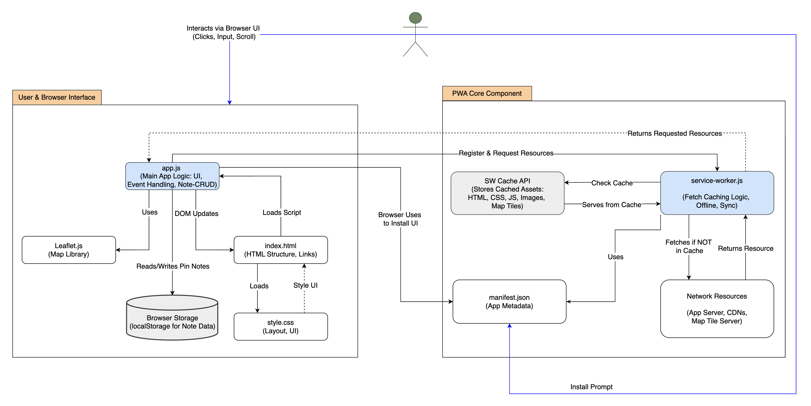
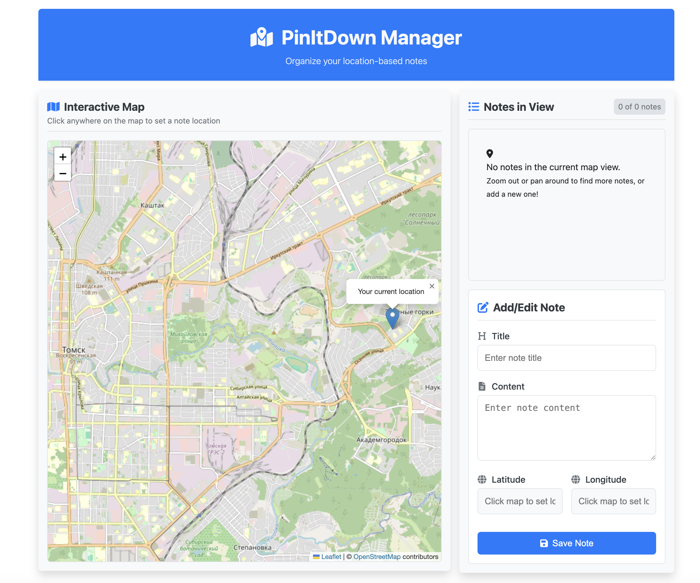
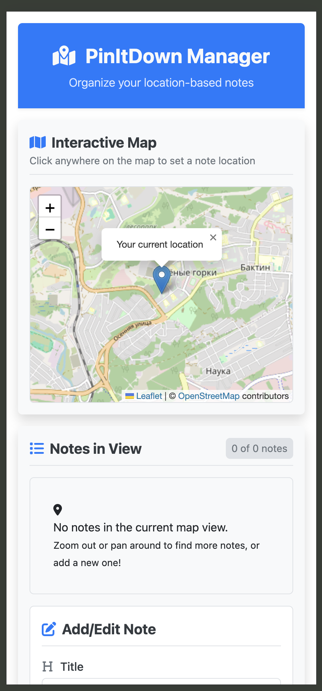
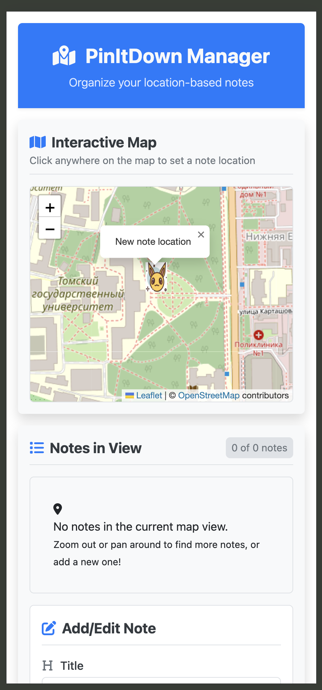
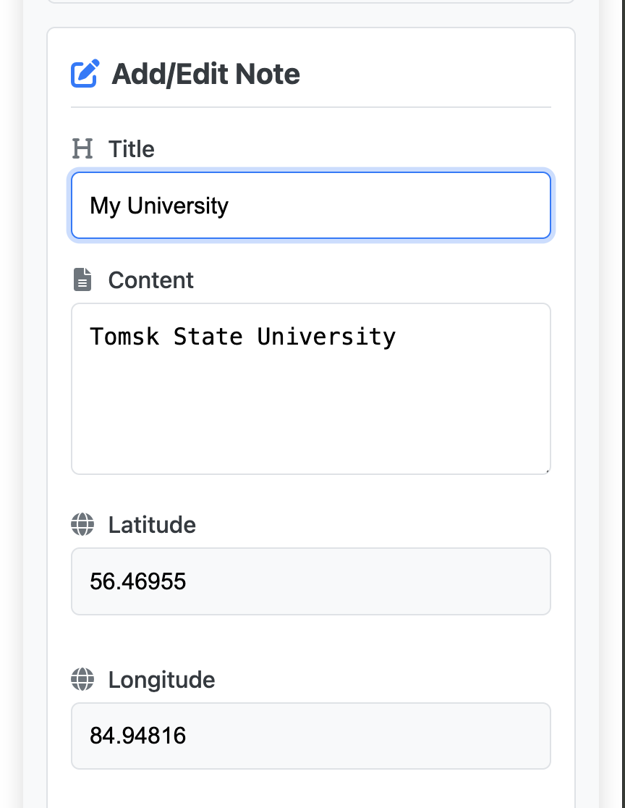
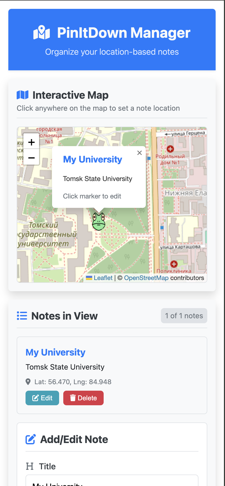
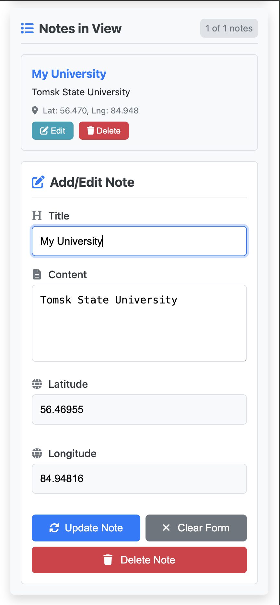
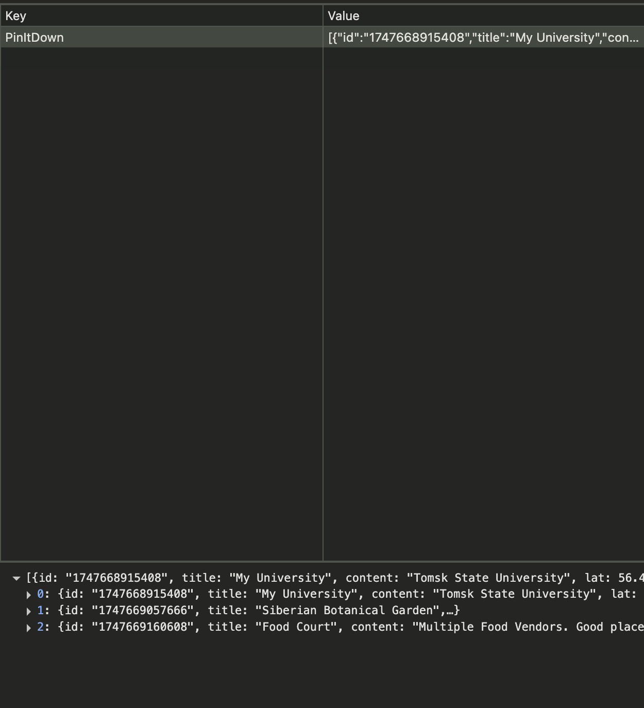
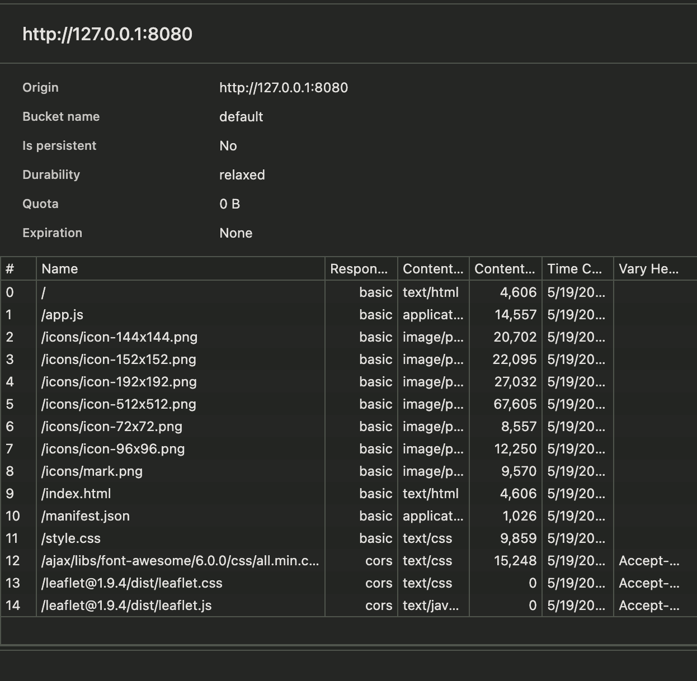

# PinItDown

PinItDown — это прогрессивное веб-приложение (PWA), которое предоставляет пользователю удобный интерфейс через файл `index.html`, стилизованный с помощью `style.css`. Основная логика приложения реализована в `app.js`, который отвечает за операции создания, чтения, обновления и удаления заметок (CRUD). Эти заметки сохраняются локально в браузере с помощью `localStorage`, что обеспечивает их сохранность между сессиями. Для отображения интерактивной карты используется библиотека `Leaflet.js,` позволяющая пользователю прикреплять заметки к определённым географическим точкам. Чтобы обеспечить работу в офлайн-режиме и ускоренную загрузку, в app.js регистрируется service worker `(service-worker.js)` — фоновый скрипт, который перехватывает все сетевые запросы на ресурсы приложения (HTML, CSS, JS, тайлы карты и др.).

Процесс работы следующий:

* Сначала service worker проверяет, есть ли нужный ресурс в кэше (используется Cache API).
* Если ресурс уже закэширован — он немедленно возвращается приложению, обеспечивая быстрый отклик и работу без подключения к сети.
* Если ресурс отсутствует в кэше — он загружается из интернета, может быть сохранён в кэш, а затем передаётся приложению.

Файл `manifest.json` содержит метаданные (название, иконки, цвет темы, стартовая страница и др.), благодаря которым приложение можно установить на устройство.

## Диаграмма, показывающая компоненты приложения и его рабочий процесс



## Используемые Технологии

* HTML5
* CSS3 (с адаптивным подходом "mobile-first")
* JavaScript (ES6+)
* Node.js для локального запуска сервера
* [Leaflet.js](https://leafletjs.com/) - Библиотека для интерактивных карт
* [OpenStreetMap](https://www.openstreetmap.org/) - Поставщик картографических данных
* Принципы Progressive Web App (PWA):
  * Service Worker для кэширования и офлайн-поддержки.
  * Web App Manifest для возможности установки и свойств PWA.

## Установка и Запуск

1. Клонируйте репозиторий:

    ```bash
    git clone https://github.com/L00kAhead/pwa-map.git
    ```

2. Перейдите в папку проекта:

    ```bash
    cd pwa-map
    ```

    Убедитесь, что все файлы там.

3. Установите Node.js, если у вас его еще нет. [Скачайте Node.js](https://nodejs.org/en/download)

4. Установите один из локальных серверов для запуска приложения:

* Вариант 1: установите `live-server` глобально и запустите его:

    ```bash
    npm install -g live-server
    live-server
    ```

    После запуска сервер откроется по адресу 127.0.0.1:8080 или другому доступному порту.

* Вариант 2: используйте http-server:

    ```bash
    npm install -g http-server
    http-server -c-1
    ```

* Альтернатива: если вы используете VS Code, установите расширение Live Server, затем щелкните правой кнопкой мыши файл index.html и откройте его с помощью Live Server. Приложение откроется в браузере автоматически.

Если все пойдет правильно, вы увидите этот экран:


## Скриншоты приложения

| **Планшет/Просмотр на большом экране** | **Вот как это выглядит на смартфоне** | **Временный значок. При нажатии на карту** |
|:--------------------------------------:|:--------------------------------------:|:------------------------------------------:|
|  |  |  |

| **Форма для создания заметки** | **После создания заметки она будет выглядеть на карте так** | **Редактировать заметку** |
|:-----------------------------:|:------------------------------------------------------:|:--------------------------:|
|  |  |  |

| **Заметки хранятся в localStorage** | **Ресурсы кэшируются в хранилище** |
|:----------------------------------:|:----------------------------------:|
|  |  |

